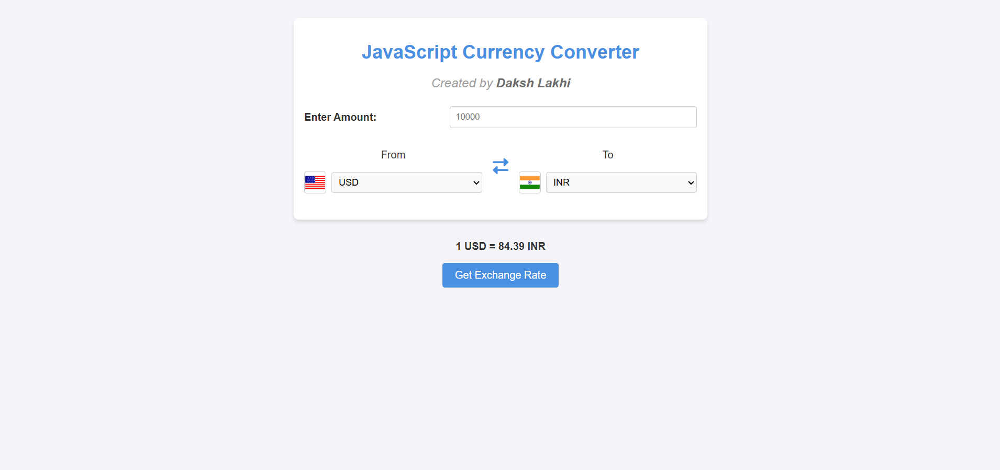

# 💱 Currency Converter Web App

A simple, sleek, and responsive Currency Converter web application built using **HTML**, **CSS**, and **JavaScript**. This project fetches real-time exchange rates using the **ExchangeRate-API** and allows users to convert between different currencies easily.

🔗 [Live Demo](https://lakhidaksh-01.github.io/Currency-Convertor/)

---

## 🚀 Features

- 🌍 Convert between major world currencies
- 🔄 Real-time exchange rate fetching via ExchangeRate-API
- 💡 Auto-updates conversion rates upon input changes
- 📱 Responsive design for both desktop and mobile
- 🔁 Swap currencies with a single click

---

## 🛠️ Tech Stack

- **Frontend**: HTML5, CSS3, JavaScript
- **API**: [ExchangeRate-API v6](https://www.exchangerate-api.com/)  
  Example endpoint format:  https://v6.exchangerate-api.com/v6/YOUR_API_KEY/latest/USD

## 📷 Screenshot

  

## Contact

For any queries or suggestions, feel free to contact me via [dakshlakhi01@gmail.com](mailto:dakshlakhi01@gmail.com).